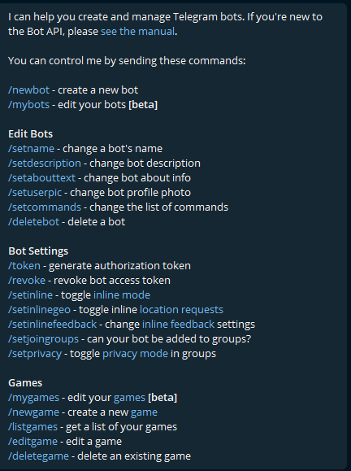
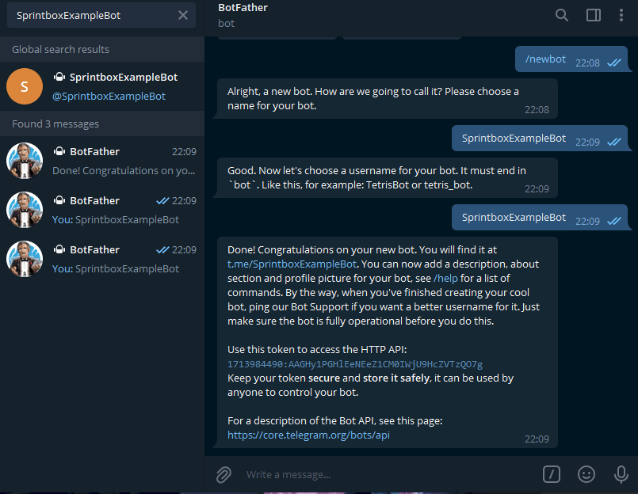
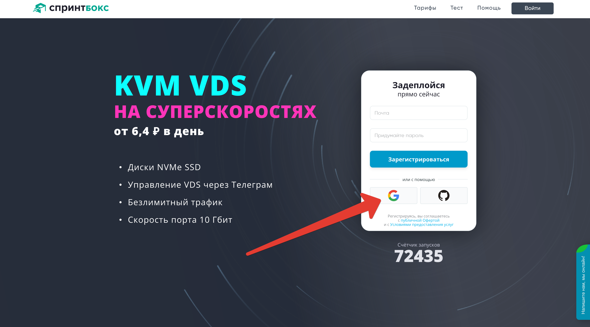
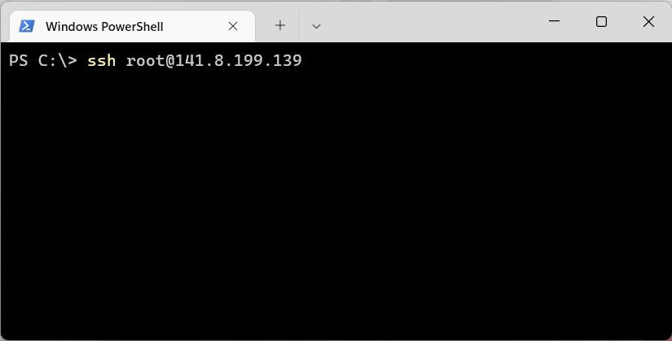
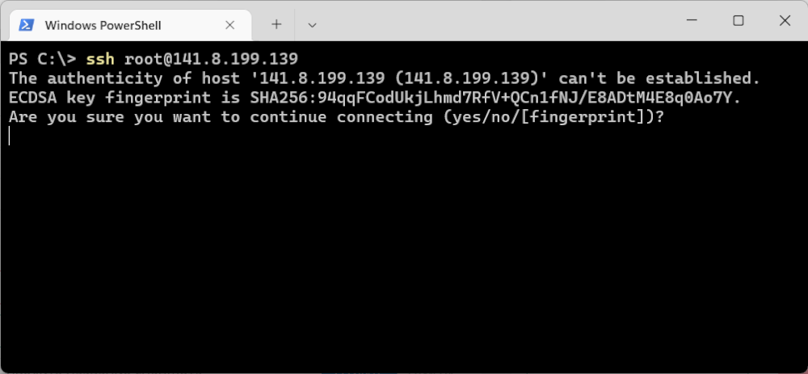
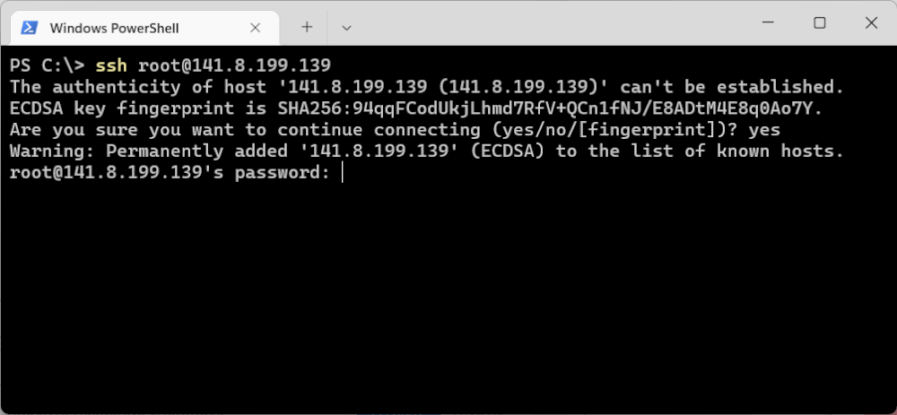
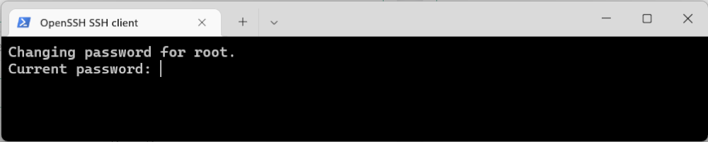
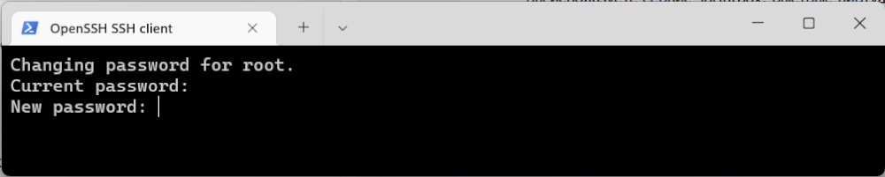
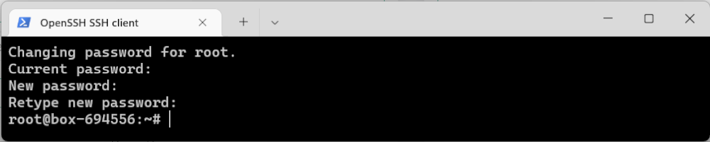

# Создание, установка и настройка бота

(bash скрипт для sprintbox)

---

## Получение аккаунта openai

1. включить VPN, подмените местоположение на страну не из санкционного списка, запомнить страну
2. зарегистрировать аккаунт gmail, указав ту страну, откуда идет vpn-траффик
3. перейти на openai.com, нажать зарегистрироваться, заполнить учетные данные используя gmail аккаунт из шага 2
4. перейти на сайт по ссылке: sms-activate.ru, зарегистрироваться любым доступным способом. Выбрать сервис для активации "ChatGPT" или "openai", выберите номер той страны, откуда идет ваш vpn траффик. Пополните любым удобным способом баланс на требуемую сумму как удобно, купите активацию
5. Указать при создании openai аккаунта номер, который вы арендовали в sms-activate
6. Дождитесь sms, вставьте sms код из окна sms-activate в окно openai, активируйте аккаунт
7. Перейдите в настройки аккаунта, найдите и скопируйте api_key openai

---

## Регистрация бота в Telegram

1. Зайдите в Telegram
2. Найдите чат [@Bot_father](https://t.me/@Bot_father)
3. Создайте бота и получите api_key telegram
4. Дальнейшие настройки бота (аватар, описание, и т.д.) - по усмотрению, инструкции найдете на месте

### Регистрация бота

Создание любого бота начинается сообщения отцу ботов в телеграме — [@Bot_father](https://t.me/@Bot_father).

Он может управлять всеми существующими ботами, с помощью множества команд. Их список в любой момент можно вызвать командой **/help**

Для создания нового бота отправьте команду **/newbot**. После ответов на пару вопросов бот будет создан, а отец ботов пришлёт токен. Его нужно будет указывать в коде для взаимодействия с BotAPI.

Токен для каждого бота уникален. Нельзя, чтобы он попал в открытый доступ. Однако если это произошло, его всегда можно сменить через ботопапу командой **/revoke**.

Так будет выглядеть диалог создания бота:

Итак, бот зарегистрирован.

---

## Регистрация выделенного сервера SprintBOX

Идем по [ссылке на проверенный сервис VDS c промокодом на скидку](https://sprintbox.ru/promo/V74QI-42N9K-3H9SO) и регистрируемся, например, через тот же **gmail**:

## Настройка SprintBOX автоматическая

## Настройка SprintBOX в ручном режиме

### Подключение по SSH

**_SSH_** — защищенный сетевой протокол. Он позволяет установить соединение по зашифрованному туннелю и управлять удаленным сервером. Для боксов с чистыми ОС — это основной способ взаимодействия с ними.

Для соединения с VDS используйте:

    логин — root
    пароль пользователя root, который пришел на почту в момент создания бокса
    IP-адрес бокса — он тоже есть в письме, а еще можно посмотреть его в блоке управления боксом.

В современных ОС для подключения по SSH есть встроенные инструменты: в Linux и MacOS — программа «Терминал», в Windows — PowerShell.

Откройте программу и введите в адресную строку: ssh root@IP-адрес

При первом подключении к серверу программа предупредит, что к этому хосту она еще не подключалась и попросит добавить его в список доверенных. Введите yes и нажмите Enter.

Дальше программа попросит пароль — он в письме, отправленном вам при создании бокса. Пароль можно скопировать и вставить или ввести вручную — символы отображаться не будут, даже замаскированными, так системы обеспечивают безопасность пароля.

При первом подключении система попросит изменить пароль. Сначала введите текущий — можно не вручную, а вставить его из буфера обмена. Символы по-прежнему не будут отображаться:

Дальше система попросит придумать новый пароль:

И повторить его:

Готово! Теперь можно работать с боксом:

При следующих подключениях будет достаточно ввести команду ssh root@IP-адрес, а затем пароль. Подтверждать добавление хоста в список доверенных и менять пароль уже не нужно.

(инструкция)[https://help.sprintbox.ru/perl-python-nodejs/python-telegram-bots]

### установка следующих пакетов:

- `python`
- `git`

### Требуется установка следующих библиотек python

- `openai`
- `telebot`
- `os`
- `sqlite3`
- `datetime`

### Настройка окружения

#### Создать файл .env

...требуется скрипт, создающий .env и записывающий TG_TOKEN и OPENAI_TOKEN в файл, присваивая данные с использованием prompt командной строки

## запустить скрипт на сервере

# PROFIT!!!
